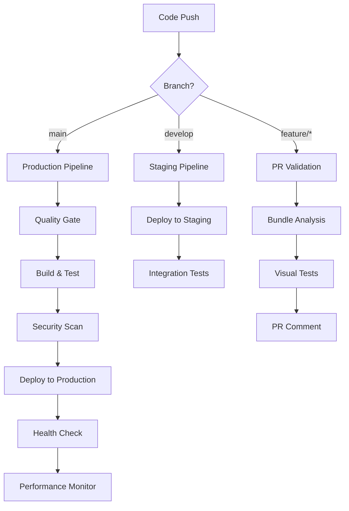

# 🚀 PixelVault CI/CD Pipeline

## 📋 Overview

This directory contains the complete CI/CD pipeline for PixelVault, designed to ensure high-quality, performant deployments while maintaining our speed-first philosophy.

## 🔄 Workflows

### 1. 🚀 Main CI/CD Pipeline (`ci.yml`)
**Triggered on:** Push to `main` and `develop`, Pull Requests to `main`

**Stages:**
1. **Quality Gate** - TypeScript, ESLint, and test validation
2. **Build & Analysis** - Production build with performance analysis
3. **Docker Build** - Multi-platform container image
4. **Deployment** - Automated deployment to production
5. **Monitoring** - Post-deployment health checks

**Key Features:**
- ✅ Comprehensive code quality checks
- 📊 Bundle size analysis and performance budgets
- 🐳 Multi-platform Docker builds
- 🚀 Automated deployments
- 📱 Post-deployment monitoring

### 2. 🔍 PR Validation (`pr-validation.yml`)
**Triggered on:** Pull Request events

**Features:**
- 📊 Bundle size impact analysis
- 👁️ Visual regression testing with Playwright
- 🔒 Security audits
- ♿ Accessibility testing
- 📱 Automated PR comments with analysis

### 3. 🚀 Multi-Environment Deployment (`deploy.yml`)
**Triggered on:** Push to specific branches, manual workflow dispatch

**Environments:**
- **Production** (`main` branch)
- **Staging** (`develop` branch)
- **Preview** (feature branches)

**Deployment Targets:**
- 🌐 GitHub Pages (primary)
- ⚡ Vercel (alternative)
- ☁️ AWS S3 + CloudFront (enterprise)

### 4. 📊 Performance Monitoring (`performance-monitoring.yml`)
**Triggered on:** Daily schedule, manual dispatch

**Monitoring:**
- 🎯 Lighthouse audits
- 📈 Core Web Vitals tracking
- 📦 Bundle size monitoring
- 🔍 Uptime and health checks
- 🚨 Automated alerts for performance degradation

## 🔧 Configuration

### Required Secrets

Set these in your GitHub repository settings:

```bash
# Firebase Configuration
FIREBASE_API_KEY=your_api_key
FIREBASE_AUTH_DOMAIN=your_project.firebaseapp.com
FIREBASE_PROJECT_ID=your_project_id
FIREBASE_STORAGE_BUCKET=your_project.appspot.com
FIREBASE_MESSAGING_SENDER_ID=123456789
FIREBASE_APP_ID=1:123456789:web:abcdef

# Deployment Secrets (Optional)
VERCEL_TOKEN=your_vercel_token
VERCEL_ORG_ID=your_org_id
VERCEL_PROJECT_ID=your_project_id

# AWS Secrets (Optional)
AWS_ACCESS_KEY_ID=your_access_key
AWS_SECRET_ACCESS_KEY=your_secret_key

# GitHub Token (automatically provided)
GITHUB_TOKEN=${{ secrets.GITHUB_TOKEN }}
```

### Required Variables

Set these in your repository or environment settings:

```bash
# API Configuration
API_URL=https://api.pixelvault.app

# AWS Configuration (if using)
AWS_REGION=us-east-1
S3_BUCKET_NAME=pixelvault-prod
CLOUDFRONT_DISTRIBUTION_ID=E123456789

# Feature Flags
USE_VERCEL=false
USE_AWS=false
```

## 📊 Performance Budgets

Our CI/CD enforces strict performance budgets:

| Resource | Budget | Enforcement |
|----------|--------|-------------|
| **JavaScript** | 500 KB | 🚨 Build fails if exceeded |
| **CSS** | 100 KB | 🚨 Build fails if exceeded |
| **Images** | 1 MB | ⚠️ Warning if exceeded |
| **Total Bundle** | 2 MB | 🚨 Build fails if exceeded |

## 🎯 Quality Gates

Every deployment must pass:

- ✅ **TypeScript** - Zero compilation errors
- ✅ **ESLint** - Zero linting errors, max warnings: 0
- ✅ **Performance Budget** - All budgets within limits
- ✅ **Bundle Analysis** - Size impact documented
- ✅ **Security Audit** - No high/critical vulnerabilities
- ✅ **Accessibility** - WCAG compliance maintained

## 🔄 Deployment Flow



## 🚨 Alerts & Monitoring

### Automated Alerts
- 📦 **Bundle Size** - Alert if >50KB increase
- ⚡ **Performance** - Alert if Lighthouse score <90
- 🔍 **Uptime** - Alert if availability <95%
- 🚨 **Build Failures** - Immediate notification

### Monitoring Dashboards
- 📊 **Performance Dashboard** - Real-time metrics
- 📈 **Bundle Size Trends** - Historical analysis
- 🔍 **Uptime Monitoring** - 24/7 availability tracking
- 🚨 **Error Tracking** - Deployment issues

## 🛠️ Local Development

### Running Quality Checks Locally

```bash
# Full quality check (same as CI)
npm run ci:check

# Individual checks
npm run type-check    # TypeScript validation
npm run lint          # ESLint check
npm run lint:fix      # Auto-fix linting issues
npm run format:check  # Prettier check
npm run format        # Auto-format code

# Performance analysis
npm run build:production
npm run analyze:bundle
npm run check:budget
```

### Testing Deployments Locally

```bash
# Test production build
npm run build:production
npm run preview

# Test Docker deployment
docker build -t pixelvault .
docker run -p 3000:3000 pixelvault

# Test with Docker Compose
docker-compose up -d
```

## 🔧 Customization

### Adding New Environments

1. **Create branch protection rule**
2. **Add environment secrets** in GitHub
3. **Update deploy.yml** with new environment logic
4. **Configure deployment target** (Vercel, AWS, etc.)

### Modifying Performance Budgets

Edit `gulpfile.js` budget configuration:

```javascript
const performanceBudgets = {
  javascript: 500 * 1024, // 500KB
  css: 100 * 1024,        // 100KB
  images: 1024 * 1024,    // 1MB
  total: 2 * 1024 * 1024  // 2MB
};
```

### Custom Quality Checks

Add to `.github/workflows/ci.yml`:

```yaml
- name: 🔍 Custom Quality Check
  run: |
    # Your custom validation logic
    npm run custom-check
```

## 📚 Best Practices

### For Contributors

1. **Run quality checks locally** before pushing
2. **Keep PRs small** for faster review cycles
3. **Monitor bundle size** impact in PR comments
4. **Test on multiple devices** before submitting
5. **Update documentation** for breaking changes

### For Maintainers

1. **Review performance impact** of all changes
2. **Monitor CI/CD pipeline health** regularly
3. **Update dependencies** via Dependabot PRs
4. **Investigate performance alerts** immediately
5. **Keep deployment secrets** secure and rotated

## 🔍 Troubleshooting

### Common Issues

**Build Failures:**
```bash
# Check build locally
npm run build:production

# Check bundle size
npm run analyze:bundle
```

**Performance Budget Exceeded:**
```bash
# Analyze what's causing the increase
npm run bundle-analyze

# Check for unnecessary dependencies
npm run lint -- --report-unused-disable-directives
```

**Deployment Failures:**
- Check environment secrets are configured
- Verify deployment target is accessible
- Review deployment logs in Actions tab

### Getting Help

1. **Check GitHub Actions logs** for detailed error messages
2. **Review performance reports** in Actions artifacts
3. **Create an issue** using our bug report template
4. **Ask in discussions** for community support

## 🎯 Metrics & KPIs

Our CI/CD tracks these key metrics:

- **🎯 Deployment Success Rate**: >99%
- **⚡ Average Build Time**: <5 minutes
- **📦 Bundle Size**: <500KB JavaScript
- **🔍 Uptime**: >99.9%
- **🚀 Time to Deploy**: <10 minutes
- **🐛 Bug Escape Rate**: <1%

---

## 🚀 Ready to Contribute?

Our CI/CD pipeline is designed to make contributing easy and safe:

1. **Fork the repository**
2. **Create a feature branch**
3. **Make your changes**
4. **Push and create a PR**
5. **Watch automated checks run**
6. **Address any feedback**
7. **Celebrate your contribution!** 🎉

The pipeline will guide you through the process with automated feedback and suggestions.

**Happy coding!** 🎨✨# 🚀 PixelVault CI/CD Pipeline

## 📋 Overview

This directory contains the complete CI/CD pipeline for PixelVault, designed to ensure high-quality, performant deployments while maintaining our speed-first philosophy.

## 🔄 Workflows

### 1. 🚀 Main CI/CD Pipeline (`ci.yml`)
**Triggered on:** Push to `main` and `develop`, Pull Requests to `main`

**Stages:**
1. **Quality Gate** - TypeScript, ESLint, and test validation
2. **Build & Analysis** - Production build with performance analysis
3. **Docker Build** - Multi-platform container image
4. **Deployment** - Automated deployment to production
5. **Monitoring** - Post-deployment health checks

**Key Features:**
- ✅ Comprehensive code quality checks
- 📊 Bundle size analysis and performance budgets
- 🐳 Multi-platform Docker builds
- 🚀 Automated deployments
- 📱 Post-deployment monitoring

### 2. 🔍 PR Validation (`pr-validation.yml`)
**Triggered on:** Pull Request events

**Features:**
- 📊 Bundle size impact analysis
- 👁️ Visual regression testing with Playwright
- 🔒 Security audits
- ♿ Accessibility testing
- 📱 Automated PR comments with analysis

### 3. 🚀 Multi-Environment Deployment (`deploy.yml`)
**Triggered on:** Push to specific branches, manual workflow dispatch

**Environments:**
- **Production** (`main` branch)
- **Staging** (`develop` branch)
- **Preview** (feature branches)

**Deployment Targets:**
- 🌐 GitHub Pages (primary)
- ⚡ Vercel (alternative)
- ☁️ AWS S3 + CloudFront (enterprise)

### 4. 📊 Performance Monitoring (`performance-monitoring.yml`)
**Triggered on:** Daily schedule, manual dispatch

**Monitoring:**
- 🎯 Lighthouse audits
- 📈 Core Web Vitals tracking
- 📦 Bundle size monitoring
- 🔍 Uptime and health checks
- 🚨 Automated alerts for performance degradation

## 🔧 Configuration

### Required Secrets

Set these in your GitHub repository settings:

```bash
# Firebase Configuration
FIREBASE_API_KEY=your_api_key
FIREBASE_AUTH_DOMAIN=your_project.firebaseapp.com
FIREBASE_PROJECT_ID=your_project_id
FIREBASE_STORAGE_BUCKET=your_project.appspot.com
FIREBASE_MESSAGING_SENDER_ID=123456789
FIREBASE_APP_ID=1:123456789:web:abcdef

# Deployment Secrets (Optional)
VERCEL_TOKEN=your_vercel_token
VERCEL_ORG_ID=your_org_id
VERCEL_PROJECT_ID=your_project_id

# AWS Secrets (Optional)
AWS_ACCESS_KEY_ID=your_access_key
AWS_SECRET_ACCESS_KEY=your_secret_key

# GitHub Token (automatically provided)
GITHUB_TOKEN=${{ secrets.GITHUB_TOKEN }}
```

### Required Variables

Set these in your repository or environment settings:

```bash
# API Configuration
API_URL=https://api.pixelvault.app

# AWS Configuration (if using)
AWS_REGION=us-east-1
S3_BUCKET_NAME=pixelvault-prod
CLOUDFRONT_DISTRIBUTION_ID=E123456789

# Feature Flags
USE_VERCEL=false
USE_AWS=false
```

## 📊 Performance Budgets

Our CI/CD enforces strict performance budgets:

| Resource | Budget | Enforcement |
|----------|--------|-------------|
| **JavaScript** | 500 KB | 🚨 Build fails if exceeded |
| **CSS** | 100 KB | 🚨 Build fails if exceeded |
| **Images** | 1 MB | ⚠️ Warning if exceeded |
| **Total Bundle** | 2 MB | 🚨 Build fails if exceeded |

## 🎯 Quality Gates

Every deployment must pass:

- ✅ **TypeScript** - Zero compilation errors
- ✅ **ESLint** - Zero linting errors, max warnings: 0
- ✅ **Performance Budget** - All budgets within limits
- ✅ **Bundle Analysis** - Size impact documented
- ✅ **Security Audit** - No high/critical vulnerabilities
- ✅ **Accessibility** - WCAG compliance maintained

## 🔄 Deployment Flow


## 🚨 Alerts & Monitoring

### Automated Alerts
- 📦 **Bundle Size** - Alert if >50KB increase
- ⚡ **Performance** - Alert if Lighthouse score <90
- 🔍 **Uptime** - Alert if availability <95%
- 🚨 **Build Failures** - Immediate notification

### Monitoring Dashboards
- 📊 **Performance Dashboard** - Real-time metrics
- 📈 **Bundle Size Trends** - Historical analysis
- 🔍 **Uptime Monitoring** - 24/7 availability tracking
- 🚨 **Error Tracking** - Deployment issues

## 🛠️ Local Development

### Running Quality Checks Locally

```bash
# Full quality check (same as CI)
npm run ci:check

# Individual checks
npm run type-check    # TypeScript validation
npm run lint          # ESLint check
npm run lint:fix      # Auto-fix linting issues
npm run format:check  # Prettier check
npm run format        # Auto-format code

# Performance analysis
npm run build:production
npm run analyze:bundle
npm run check:budget
```

### Testing Deployments Locally

```bash
# Test production build
npm run build:production
npm run preview

# Test Docker deployment
docker build -t pixelvault .
docker run -p 3000:3000 pixelvault

# Test with Docker Compose
docker-compose up -d
```

## 🔧 Customization

### Adding New Environments

1. **Create branch protection rule**
2. **Add environment secrets** in GitHub
3. **Update deploy.yml** with new environment logic
4. **Configure deployment target** (Vercel, AWS, etc.)

### Modifying Performance Budgets

Edit `gulpfile.js` budget configuration:

```javascript
const performanceBudgets = {
  javascript: 500 * 1024, // 500KB
  css: 100 * 1024,        // 100KB
  images: 1024 * 1024,    // 1MB
  total: 2 * 1024 * 1024  // 2MB
};
```

### Custom Quality Checks

Add to `.github/workflows/ci.yml`:

```yaml
- name: 🔍 Custom Quality Check
  run: |
    # Your custom validation logic
    npm run custom-check
```

## 📚 Best Practices

### For Contributors

1. **Run quality checks locally** before pushing
2. **Keep PRs small** for faster review cycles
3. **Monitor bundle size** impact in PR comments
4. **Test on multiple devices** before submitting
5. **Update documentation** for breaking changes

### For Maintainers

1. **Review performance impact** of all changes
2. **Monitor CI/CD pipeline health** regularly
3. **Update dependencies** via Dependabot PRs
4. **Investigate performance alerts** immediately
5. **Keep deployment secrets** secure and rotated

## 🔍 Troubleshooting

### Common Issues

**Build Failures:**
```bash
# Check build locally
npm run build:production

# Check bundle size
npm run analyze:bundle
```

**Performance Budget Exceeded:**
```bash
# Analyze what's causing the increase
npm run bundle-analyze

# Check for unnecessary dependencies
npm run lint -- --report-unused-disable-directives
```

**Deployment Failures:**
- Check environment secrets are configured
- Verify deployment target is accessible
- Review deployment logs in Actions tab

### Getting Help

1. **Check GitHub Actions logs** for detailed error messages
2. **Review performance reports** in Actions artifacts
3. **Create an issue** using our bug report template
4. **Ask in discussions** for community support

## 🎯 Metrics & KPIs

Our CI/CD tracks these key metrics:

- **🎯 Deployment Success Rate**: >99%
- **⚡ Average Build Time**: <5 minutes
- **📦 Bundle Size**: <500KB JavaScript
- **🔍 Uptime**: >99.9%
- **🚀 Time to Deploy**: <10 minutes
- **🐛 Bug Escape Rate**: <1%

---

## 🚀 Ready to Contribute?

Our CI/CD pipeline is designed to make contributing easy and safe:

1. **Fork the repository**
2. **Create a feature branch**
3. **Make your changes**
4. **Push and create a PR**
5. **Watch automated checks run**
6. **Address any feedback**
7. **Celebrate your contribution!** 🎉

The pipeline will guide you through the process with automated feedback and suggestions.

**Happy coding!** 🎨✨